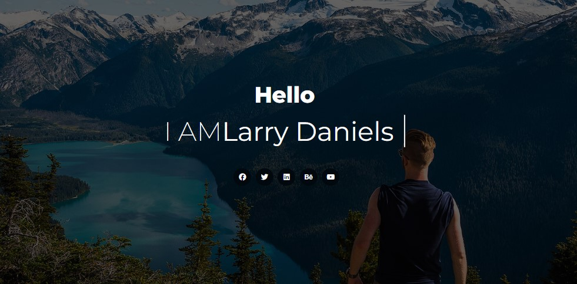

# 🌐 My Website Project

A clean and responsive website built using **HTML** and **CSS**.  
This project focuses on front-end layout, responsive design, and modern web styling practices — without using any frameworks or JavaScript.

---

## ✨ Features

- 🧱 Fully responsive design for all devices  
- 🎨 Clean and modern UI  
- 📱 Mobile-friendly layout  
- 🧩 Organized HTML structure with semantic tags  
- 💅 Reusable and well-structured CSS

---

## 🚀 Live Demo

🔗 [View Website](https://denial-web-site.vercel.app/)  

## 🧰 Technologies Used

| Technology | Description |
|-------------|-------------|
| 🧩 **HTML5** | Page structure and semantic markup |
| 🎨 **CSS3** | Styling, layout, and responsiveness |

---

## 📸 Screenshots




---

## ⚙️ How to Use Locally

You can clone and run this project on your local machine:

```bash
# Clone this repository
git clone (https://github.com/alaamarey/Denial-WebSite.git)

# Go into the folder
cd your-repo-name

# Open index.html in your browser

📁 Project Structure
project-folder/
│
├── index.html
├── css/
│   └── all.min.css
│   └── bootstrap.min.css
│   └── media.css
│   └── style.css
├── js/
|  └── bootstrap.bundle.min.js
├── webfonts/
|      └── ....
├── fonts/
|   └── ....
└── images/
    └── ...


If you like this project, please ⭐ star the repo and share your feedback!
I'm open to suggestions and improvements 😊
